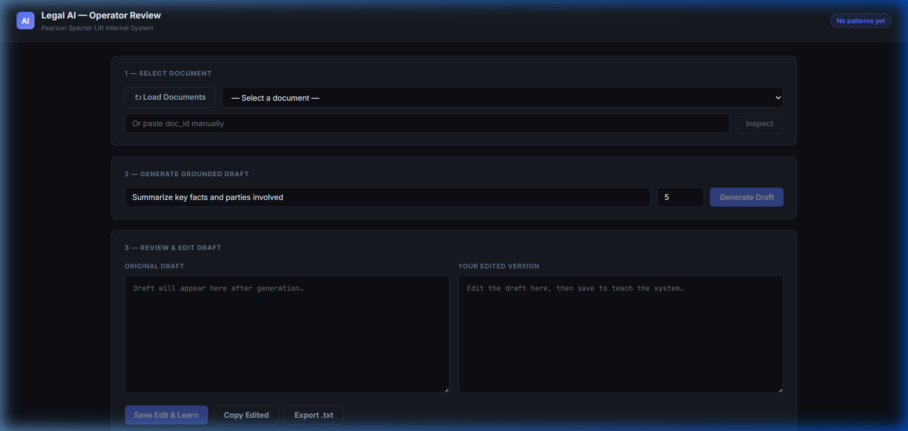
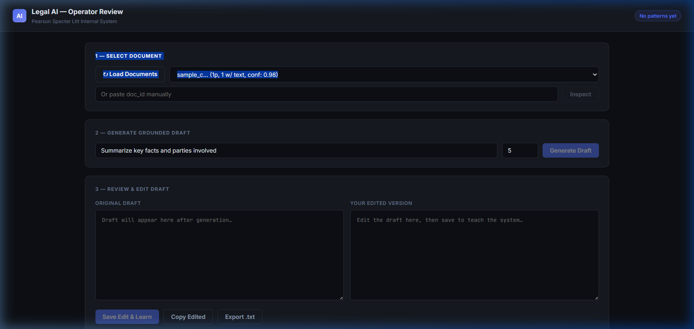

# Legal AI System — Assessment Submission

**Pearson Specter Litt AI Engineer Take-Home | Submitted by: Tarqul Alam Opi**

An AI-powered pipeline that ingests messy legal-style PDFs, extracts structured fields, retrieves grounded evidence, generates citation-backed case fact summaries, and improves over time by learning from operator edits.

---

## Quick Start (3 minutes)

```bash
# 1. Clone and enter repo
git clone https://github.com/taopi74/legal-ai-system_assessment.git
cd legal-ai-system_assessment

# 2. Create virtual environment
python -m venv .venv
# Windows:
.venv\Scripts\activate
# Mac/Linux:
source .venv/bin/activate

# 3. Install dependencies
pip install -r requirements.txt

# 4. Configure environment
copy .env.example .env       # Windows
# cp .env.example .env       # Mac/Linux
# → Edit .env and set GEMINI_API_KEY=your_key_here

# 5. Start the server
uvicorn src.api:app --reload

# 6. Open the Operator Review UI
# → http://127.0.0.1:8000/review
# → API docs: http://127.0.0.1:8000/docs
```

### Docker (optional)
```bash
cp .env.example .env   # fill in GEMINI_API_KEY
docker compose up --build
# → http://localhost:8000/review
```

---

## ⚠️ OCR Requirements

| Scenario | What happens |
|----------|-------------|
| Digital PDF + no API key | ✅ pdfplumber extracts text fine |
| Scanned/noisy PDF + valid GEMINI_API_KEY | ✅ Gemini Vision OCR activates |
| Scanned/noisy PDF + no API key | ⚠️ Text extraction will be empty — set GEMINI_API_KEY |
| Any PDF + Tesseract installed | ✅ Set ENABLE_TESSERACT_FALLBACK=true for offline fallback |

For fully offline operation: `sudo apt-get install tesseract-ocr` then set `ENABLE_TESSERACT_FALLBACK=true`

## What This System Does

This system provides an end-to-end AI pipeline for legal document analysis at Pearson Specter Litt. An operator uploads a PDF — even a scanned or noisy one. The system extracts text using pdfplumber, falls back to Gemini Vision OCR for low-quality pages, extracts structured fields (parties, dates, jurisdiction, key facts), chunks and embeds the content into a local ChromaDB vector store, then retrieves the most relevant evidence passages for a given query and generates a grounded Case Fact Summary with explicit citation tags. Operators review and edit the draft in a web UI; each edit is captured, analyzed by the LLM, and stored as reusable writing preferences. Future drafts automatically apply these learned patterns.

---

## Sample Workflow (End-to-End)

```bash
# Step 1: Upload a PDF
curl -X POST http://localhost:8000/upload \
  -F "file=@data/sample_inputs/sample_clean.pdf"
# → Returns: { "doc_id": "uuid-here", "status": "processed", ... }

# Step 2: Retrieve relevant passages
curl -X POST http://localhost:8000/retrieve/{doc_id} \
  -H "Content-Type: application/json" \
  -d '{"query": "What are the key facts and parties involved?", "top_k": 5}'

# Step 3: Generate a grounded draft
curl -X POST http://localhost:8000/draft/{doc_id} \
  -H "Content-Type: application/json" \
  -d '{"query": "Summarize key facts for case review", "top_k": 5}'

# Step 4: Submit operator edit to learn from it
curl -X POST http://localhost:8000/edit/{doc_id} \
  -H "Content-Type: application/json" \
  -d '{
    "original_draft": "...",
    "edited_draft": "..."
  }'

# Step 5: View learned patterns
curl http://localhost:8000/patterns

# Step 6: Re-generate (will use improved prompt with learned preferences)
curl -X POST http://localhost:8000/draft/{doc_id} \
  -H "Content-Type: application/json" \
  -d '{"query": "Summarize key facts for case review", "top_k": 5}'
```

---

## API Endpoints

| Method | Endpoint | Description |
|---|---|---|
| GET | `/health` | System status + LLM config check |
| POST | `/upload` | Upload PDF → OCR + extract + embed |
| POST | `/retrieve/{doc_id}` | Retrieve top-k evidence chunks |
| POST | `/draft/{doc_id}` | Generate grounded case fact summary |
| GET | `/draft/{doc_id}/evidence-map` | Inspect which evidence backs the draft |
| POST | `/edit/{doc_id}` | Submit operator edit → learn patterns |
| GET | `/patterns` | View all learned writing patterns |
| POST | `/reset-patterns` | Reset learned patterns |
| GET | `/documents` | List all uploaded documents |
| GET | `/documents/{doc_id}` | Get document metadata + structured fields |
| DELETE | `/documents/{doc_id}` | Delete document + embeddings |
| GET | `/review` | Operator Review UI (browser) |

---

## Architecture Layout

| Layer | File(s) | Responsibility |
|---|---|---|
| API Wiring | `src/api.py` | App setup, middleware, static mount |
| Routers | `src/routers/` | Domain-separated endpoints |
| State | `src/app_state.py` | Shared runtime services |
| Config | `src/config.py` | Path management |
| Processing | `src/document_processor.py` | PDF OCR, text extraction, structured fields |
| Embedding | `src/embedder.py`, `src/embeddings.py` | Chunk + embed into ChromaDB |
| Retrieval | `src/retriever.py` | Top-k evidence retrieval with scores |
| Generation | `src/draft_generator.py` | Grounded draft with citation guard |
| Feedback | `src/feedback_loop.py` | Edit capture + pattern learning |
| LLM | `src/llm_provider.py` | Gemini / Claude / OpenAI abstraction |
| Prompts | `prompts/*.txt` | Externalised, editable prompt templates |
| UI | `web/` | Operator React review interface |

---

## Environment Variables

| Variable | Default | Description |
|---|---|---|
| `GEMINI_API_KEY` | — | **Required** for Gemini provider |
| `LLM_PROVIDER` | `gemini` | `gemini` / `claude` / `openai` |
| `LLM_MODEL` | `gemini-1.5-pro` | Model name for generation |
| `EMBEDDING_MODEL` | `models/text-embedding-004` | Embedding model |
| `TOP_K` | `5` | Default evidence chunks to retrieve |
| `CHUNK_SIZE` | `500` | Words per chunk |
| `CHUNK_OVERLAP` | `50` | Overlap between chunks |
| `ENABLE_TESSERACT_FALLBACK` | `false` | Enable Tesseract as secondary OCR |
| `GROUNDING_AUTO_REGENERATE` | `true` | Auto-fix grounding violations |
| `GROUNDING_MAX_ATTEMPTS` | `2` | Max regeneration attempts |
| `RATE_LIMIT_PER_MINUTE` | `60` | Requests per IP per minute |
| `BASIC_AUTH_API_KEY` | — | Optional API key auth |
| `STORAGE_BACKEND` | `json` | `json` / `sqlite` / `hybrid` |

---

## Features Implemented

- **OCR pipeline with fallback**: pdfplumber → Gemini Vision OCR (parallel, configurable workers)
- **Structured field extraction**: case_number, parties, key_dates, jurisdiction, document_type, key_facts, notable_gaps
- **Token-aware chunking** with page-level metadata preserved
- **ChromaDB vector store** with Google text-embedding-004
- **Grounded retrieval** with evidence IDs, scores, and page hints
- **Citation-aware draft generation** constrained to retrieved evidence
- **Grounding guard**: detects invalid citations + sections missing citations, auto-regenerates
- **Improved prompt routing**: uses `improved_generation_prompt.txt` once operator patterns exist
- **Operator edit capture** with JSON + optional SQLite storage
- **LLM-powered pattern extraction** from diffs (style_notes, content_corrections, structural_preferences)
- **Document management**: list, inspect, delete with chunk cleanup
- **Middleware**: API-key auth, per-IP rate limiting, request-ID tracing, latency logging
- **Operator Review UI**: React-based, load docs, generate draft, side-by-side edit, copy/export
- **Tests**: 7 test files covering API, processor, retriever, feedback, draft generator

---

## System in Action

Below are screenshots demonstrating the system's core functionalities in the Operator Review UI.

### 1. Initial State
When the server starts, the Operator Review UI provides a clean interface to manage and analyze legal documents.



### 2. Document Loading & Selection
After clicking "Load Documents", the system fetches all processed documents from the `data/extracted` directory. You can select a document to begin the review process.



### 3. Structured Field Inspection & Drafting
Once a document is selected and "Inspected", the system displays the extracted structured fields (Parties, Dates, Facts). Operators can then generate a grounded draft summary, which includes citation tags back to the source evidence.

---

## Running Tests

```bash
pytest tests/ -v
```

---

## Sample Inputs

Three synthetic legal documents are provided in `data/sample_inputs/`:

| File | Type | Description |
|---|---|---|
| `sample_clean.pdf` | Clean digital | High Court Particulars of Claim — logistics dispute |
| `sample_noisy.pdf` | Sparse/scanned | Affidavit of Service with partially illegible content |
| `sample_mixed.pdf` | Multi-page mixed | Settlement offer letter + scanned exhibit + chronology |

---

## Additional Docs

- [`architecture.md`](architecture.md) — System architecture and design choices
- [`assumptions_tradeoffs.md`](assumptions_tradeoffs.md) — Key decisions and their trade-offs
- [`evaluation.md`](evaluation.md) — Evaluation approach and results
